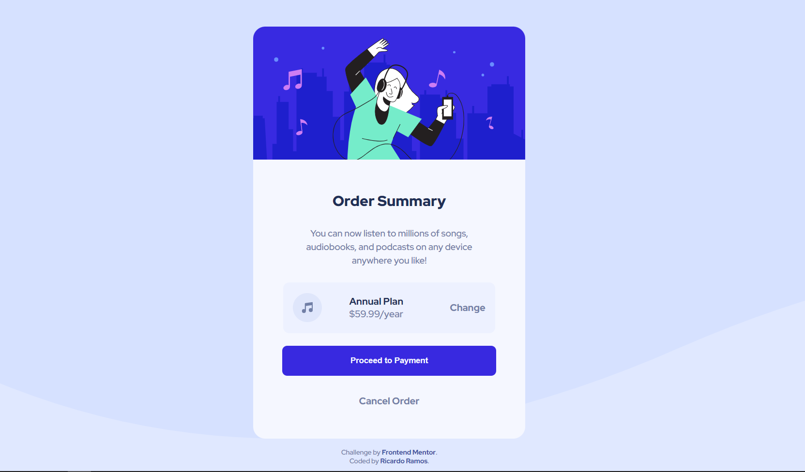

# Frontend Mentor - Order summary card solution

This is a solution to the [Order summary card challenge on Frontend Mentor](https://www.frontendmentor.io/challenges/order-summary-component-QlPmajDUj). Frontend Mentor challenges help you improve your coding skills by building realistic projects. 

## Table of contents

- [Overview](#overview)
  - [The challenge](#the-challenge)
  - [Screenshot](#screenshot)
  - [Links](#links)
- [My process](#my-process)
  - [Built with](#built-with)
  - [What I learned](#what-i-learned)
  - [Continued development](#continued-development)
- [Author](#author)

## Overview

### The challenge

Users should be able to:

- See hover states for interactive elements

### Screenshot

Desktop View

Mobile View

### Links

- Solution URL: [Code on Github](https://github.com/MrRicram/order-summary-component)
- Live Site URL: [Live site url](https://mrricram.github.io/order-summary-component/)

## My process

### Built with

- Semantic HTML5 markup
- SCSS custom properties
- Flexbox
- Mobile-first workflow

### What I learned

Last challenge started with a desktop-first workflow, however in this one I challenged myself to start with a mobile-first approach.

### Continued development

I'm focused on improving my front-end skills by doing more of this challenges.

## Author

- Website - Comming soon...
- Frontend Mentor - [@MrRicram](https://www.frontendmentor.io/profile/MrRicram)
